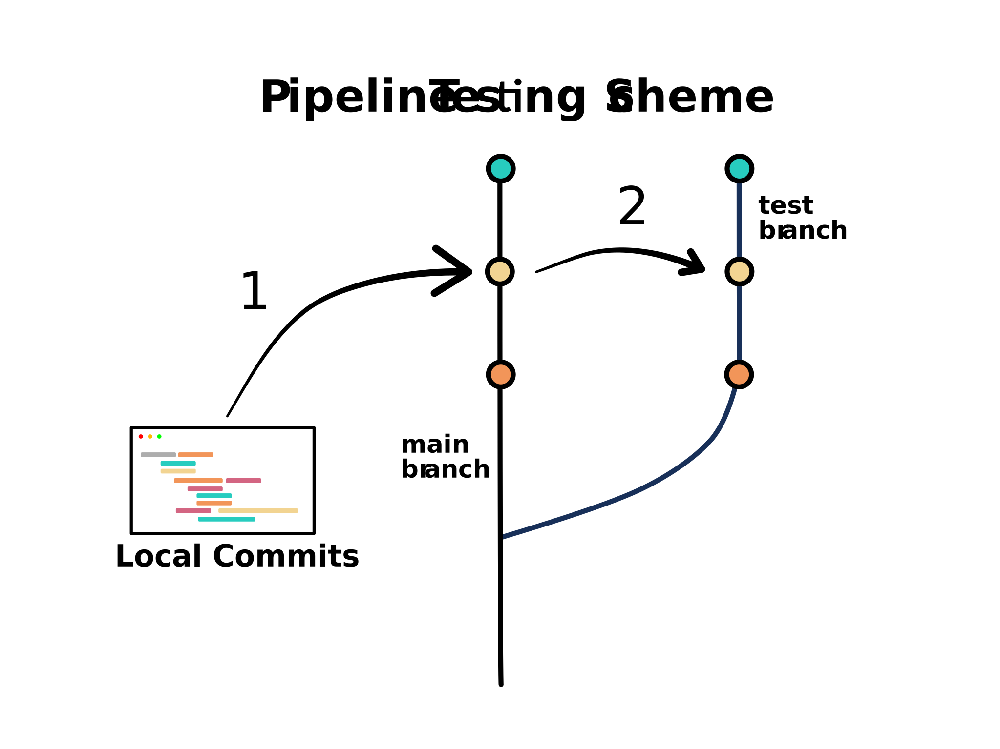

# cutTag-pipeline

[](https://svgshare.com/i/Zhy.svg)

[](https://shields.io/)


## Pipeline testing scheme



**1** Push local commits to remote `main` branch

**2** GitHub Actions will sync `main` files to the `test` branch

GitHub runners will check out the `test` branch and initiate tests. The `test` branch hosts the extra hidden folder `.test`, which contains an example dataset described below.

## About the example dataset

|      | H3K4me3 | H3K4me1 |
|------|---------|---------|
| K562 | n=2     | n=2     |
| H1   | n=2     | n=2     |

**deseq2_metadata.csv**

```
sample,condition
H1_1_H3K4me1,H1
H1_1_H3K4me3,H1
H1_2_H3K4me1,H1
H1_2_H3K4me3,H1
K562_1_H3K4me1,K562
K562_1_H3K4me3,K562
K562_2_H3K4me1,K562
K562_2_H3K4me3,K562
```

Source: https://www.nature.com/articles/s41467-019-09982-5

## Important information

* Do not pull request `test` into `main` branch

* Push script updates to `main`, and push testing-related files to `test` only. Testing-related files include:

    * GitHub Actions workflows `.github/workflows/\*.yaml`

    * example datasets `.test/data/raw`

    * configuration files `.test/data/src files`

    * genome indices `.test/testdata`
