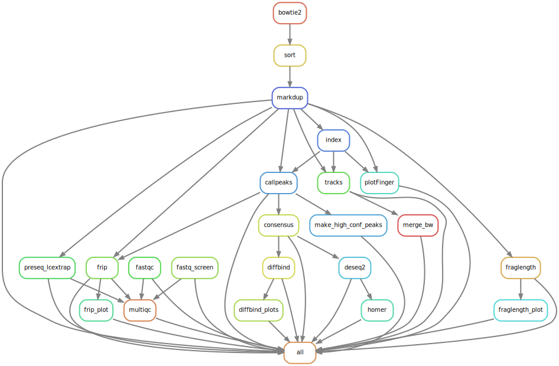
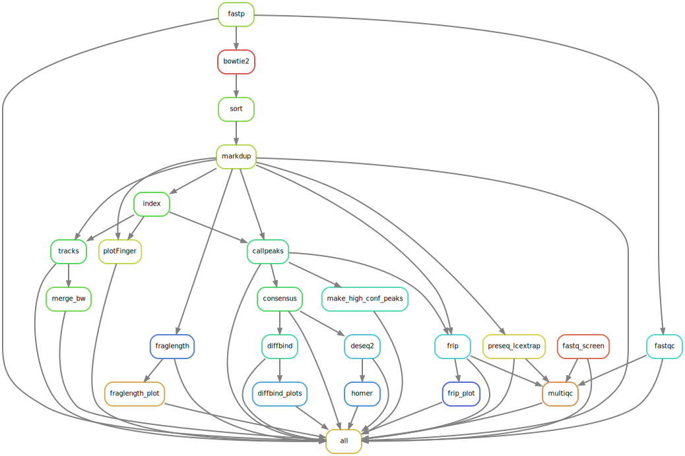

# cutTag-pipeline

<!-- [](https://svgshare.com/i/Zhy.svg) -->

[](https://shields.io/)


Snakemake pipeline for Cut&amp;Tag analysis 

# Setup

If you do not have a Snakemake environment, please follow the instructions in the maxsonBraunLab [Snakemake setup repository](https://github.com/maxsonBraunLab/snakemake_setup) to create one.

**NOTE:** Some of the setup instructions are tailored for working on Oregon Health and Science University's Linux-based Exacloud computing cluster. If you have access to another computing cluster, then some steps may need to be modified accordingly.

## 1. Configure the project directory

On the Github repo for this pipeline, click the green "Code" button near the top right corner and copy the Clone / HTTPS URL (ends with .git). Then run the following on the command line:

```bash
# cd into a project directory

# paste the copied URL after `git clone` command to get a copy of pipeline
git clone <URL for repo>

# navigate to the main pipeline directory (where the snakefile is)
cd <main pipeline directory>

#create a directory for your fastq files
mkdir -p data/raw

# link fastqs to data/raw
ln -s /path/to/fastq/files/sample1_R1.fastq.gz data/raw
ln -s /path/to/fastq/files/sample1_R2.fastq.gz data/raw
ln -s /path/to/fastq/files/sample2_R1.fastq.gz data/raw
ln -s /path/to/fastq/files/sample2_R2.fastq.gz data/raw
...

# make scripts executable
chmod +x src/*.py src/*.sh *.sh
```

**IMPORTANT**

After creating the symlinks, rename all the symlinks in data/raw to the following format: `{condition}_{replicate}_{mark}_{R1|R2}.fastq.gz`

For example, a file with this original name **LIB200706TB_M6Q3_RBP1_S93_L001_R1_001.fastq.gz** will be renamed to
**M6Q_3_RBP1_R1.fastq.gz**

## 2. Make the sample sheet and deseq2 metadata.

Activate an environment containing snakemake, and then run the script `make_sample_sheet.py` script from the root of the directory.

```bash
$ python src/make_sample_sheet.py data/raw
```

This will make a samplesheet for the experiment called samplesheet.tsv in the root of the directory as well as the file `src/deseq2_metadata.csv`, the contents of the samplesheet will be structured like the following example:

```
sample	R1	R2	mark	condition	igg
HoxE_1_IgG	data/raw/HoxE_1_IgG_R1.fastq.gz	data/raw/HoxE_1_IgG_R2.fastq.gz	IgG	HoxE	HoxE_1_IgG
HoxE_1_Rbp1	data/raw/HoxE_1_Rbp1_R1.fastq.gz	data/raw/HoxE_1_Rbp1_R2.fastq.gz	Rbp1	HoxE	HoxE_1_Rbp1
HoxE_2_Rbp1	data/raw/HoxE_2_Rbp1_R1.fastq.gz	data/raw/HoxE_2_Rbp1_R2.fastq.gz	Rbp1	HoxE	HoxE_2_Rbp1
HoxE_3_Rbp1	data/raw/HoxE_3_Rbp1_R1.fastq.gz	data/raw/HoxE_3_Rbp1_R2.fastq.gz	Rbp1	HoxE	HoxE_3_Rbp1
HoxM_1_IgG	data/raw/HoxM_1_IgG_R1.fastq.gz	data/raw/HoxM_1_IgG_R2.fastq.gz	IgG	HoxM	HoxM_1_IgG
HoxM_1_Rbp1	data/raw/HoxM_1_Rbp1_R1.fastq.gz	data/raw/HoxM_1_Rbp1_R2.fastq.gz	Rbp1	HoxM	HoxM_1_Rbp1
HoxM_2_Rbp1	data/raw/HoxM_2_Rbp1_R1.fastq.gz	data/raw/HoxM_2_Rbp1_R2.fastq.gz	Rbp1	HoxM	HoxM_2_Rbp1
HoxM_3_Rbp1	data/raw/HoxM_3_Rbp1_R1.fastq.gz	data/raw/HoxM_3_Rbp1_R2.fastq.gz	Rbp1	HoxM	HoxM_3_Rbp1
HoxW_1_IgG	data/raw/HoxW_1_IgG_R1.fastq.gz	data/raw/HoxW_1_IgG_R2.fastq.gz	IgG	HoxW	HoxW_1_IgG
HoxW_1_Rbp1	data/raw/HoxW_1_Rbp1_R1.fastq.gz	data/raw/HoxW_1_Rbp1_R2.fastq.gz	Rbp1	HoxW	HoxW_1_Rbp1
HoxW_2_Rbp1	data/raw/HoxW_2_Rbp1_R1.fastq.gz	data/raw/HoxW_2_Rbp1_R2.fastq.gz	Rbp1	HoxW	HoxW_2_Rbp1
HoxW_3_Rbp1	data/raw/HoxW_3_Rbp1_R1.fastq.gz	data/raw/HoxW_3_Rbp1_R2.fastq.gz	Rbp1	HoxW	HoxW_3_Rbp1
```

The script splits the file name on the '_' and uses the first split for the condition, and the second split for the mark. The 'igg' column is the same as the 'sample' column and should be manually replaced with the sample name of the IGG or control you would like to use for that sample. If the sample is an IgG it can be the same as its name, and won't affect peak calling. 

So a fixed version of the table above would look like this:


```
sample	R1	R2	mark	condition	igg
HoxE_1_IgG	data/raw/HoxE_1_IgG_R1.fastq.gz	data/raw/HoxE_1_IgG_R2.fastq.gz	IgG	HoxE	HoxE_1_IgG
HoxE_1_Rbp1	data/raw/HoxE_1_Rbp1_R1.fastq.gz	data/raw/HoxE_1_Rbp1_R2.fastq.gz	Rbp1	HoxE	HoxE_1_IgG
HoxE_2_Rbp1	data/raw/HoxE_2_Rbp1_R1.fastq.gz	data/raw/HoxE_2_Rbp1_R2.fastq.gz	Rbp1	HoxE	HoxE_1_IgG
HoxE_3_Rbp1	data/raw/HoxE_3_Rbp1_R1.fastq.gz	data/raw/HoxE_3_Rbp1_R2.fastq.gz	Rbp1	HoxE	HoxE_1_IgG
HoxM_1_IgG	data/raw/HoxM_1_IgG_R1.fastq.gz	data/raw/HoxM_1_IgG_R2.fastq.gz	IgG	HoxM	HoxM_1_IgG
HoxM_1_Rbp1	data/raw/HoxM_1_Rbp1_R1.fastq.gz	data/raw/HoxM_1_Rbp1_R2.fastq.gz	Rbp1	HoxM	HoxM_1_IgG
HoxM_2_Rbp1	data/raw/HoxM_2_Rbp1_R1.fastq.gz	data/raw/HoxM_2_Rbp1_R2.fastq.gz	Rbp1	HoxM	HoxM_1_IgG
HoxM_3_Rbp1	data/raw/HoxM_3_Rbp1_R1.fastq.gz	data/raw/HoxM_3_Rbp1_R2.fastq.gz	Rbp1	HoxM	HoxM_1_IgG
HoxW_1_IgG	data/raw/HoxW_1_IgG_R1.fastq.gz	data/raw/HoxW_1_IgG_R2.fastq.gz	IgG	HoxW	HoxW_1_IgG
HoxW_1_Rbp1	data/raw/HoxW_1_Rbp1_R1.fastq.gz	data/raw/HoxW_1_Rbp1_R2.fastq.gz	Rbp1	HoxW	HoxW_1_IgG
HoxW_2_Rbp1	data/raw/HoxW_2_Rbp1_R1.fastq.gz	data/raw/HoxW_2_Rbp1_R2.fastq.gz	Rbp1	HoxW	HoxW_1_IgG
HoxW_3_Rbp1	data/raw/HoxW_3_Rbp1_R1.fastq.gz	data/raw/HoxW_3_Rbp1_R2.fastq.gz	Rbp1	HoxW	HoxW_1_IgG
```

For this example there was only one IgG per condition, so the sample name corresponding to that IGG was used for each sample in the condition. In the case that each sample had its own control file, each entry would correspond to the IgG for that sample. If only one IgG was used in the whole experiment, then its sample name could be used for each row. If you are not using IgG set config['USEIGG'] to false, and don't modify the samplesheet.


## 3. Edit configuration files 

1. Edit runtime configuration in the file `config.yml`:

   - If using Singularity containers instead of Conda, specify the path to the folder containing the Singularity image files (.sif).
   
   - Specify whether or not to trim adapters from raw reads to improve downstream alignment rate. You can decide based on adapter content in the sequencing core's FastQC reports.

   - Specify whether or not to use IGG for peak calling.

   - Specify the path to the bowtie2 index for the genome you are aligning to.

   - Specify the path to the fastq screen configuration file.

   - Specify the path to the genome FASTA file.

   - Specify the path to the chromosome sizes. 

2. The pipeline detects samples in the subdirectory data/raw with the following assumptions:

    - Paired end reads

    - Read 1 and 2 are designated using "_R1", and "_R2"

    - Samples are designated in the following convention: `{condition}_{replicate}_{mark}_{R1|R2}.fastq.gz`
      This format affects the output files and ensures the bigwig files from the same marks are merged.  

3. Make sure the `src/deseq2_metadata.csv` looks right. The file is created when you run `make_sample_sheet.py` and should have the following properties:

 - Should have two columns labeled "sample", and "condition"
 - The sample column corresponds to the individual biological replicates (includes all fields around the "_" delimiter). 
 - The condition should be the condition for each sample, which uses the first field with the "_" delimiter.
 - If you have multiple conditions and marks to analyze, you can introduce more columns into this file and adjust the deseq2.R file to account for extra covariates. 

 Below is an example of what the `src/deseq2_metadata.csv` file might look like for an experiment with various conditions, replicates, and marks/antibody targets. Note that the IgG samples are not included in differential expression analysis:

```
sample,condition
HoxE_1_Rbp1,HoxE
HoxE_2_Rbp1,HoxE
HoxE_3_Rbp1,HoxE
HoxM_1_Rbp1,HoxM
HoxM_2_Rbp1,HoxM
HoxM_3_Rbp1,HoxM
HoxW_1_Rbp1,HoxW
HoxW_2_Rbp1,HoxW
HoxW_3_Rbp1,HoxW
```

## 4. Set up SLURM integration (for batch jobs)

Do this step if are running the pipeline as a batch job and don't yet have a [SLURM profile](https://github.com/Snakemake-Profiles/slurm) set up. The SLURM profile will configure default settings for SnakeMake to interact with SLURM - more information can be found [here](https://github.com/maxsonBraunLab/slurm).

Download the `slurm` folder from the maxsonBraunLab [repository](https://github.com/maxsonBraunLab/slurm) and copy the entire thing to `~/.config/snakemake`. 

Your file configuration for SLURM should be as follows:
```
~/.config/snakemake/slurm/<files>
```

Change the file permissions for the scripts in the `slurm` folder so that they are executable. To do this, run:
```
chmod +x ~/.config/snakemake/slurm/slurm*
```

### Snakemake + SLURM + Singularity integration

**NOTE:** The `~/.config/snakemake/slurm/config.yaml` file contains settings for SnakeMake to interact with SLURM and, optionally, Conda or Singularity. If you already have an exisiting SLURM profile configured to run Snakemake with Conda (i.e., includes settings like use-conda, conda-prefix), then you will need to create a separate profile for running Snakemake with Singularity. To do this: 

1. Copy contents of base slurm profile into another folder for slurm_singularity profile:
```
cp -r ~/.config/snakemake/slurm ~/.config/snakemake/slurm_singularity
```

2. Make profile scripts executable:
```
chmod +x ~/.config/snakemake/slurm_singularity/slurm*
```

3. Remove any conda-specific settings from `~/.config/snakemake/slurm_singularity/config.yaml`

4. (Optional) Add the following lines to end of `~/.config/snakemake/slurm_singularity/config.yaml` file:
```
use-singularity: True
keep-going: True
rerun-incomplete: True
printshellcmds: True
```

## 5. (Optional) SnakeMake + Singularity Setup

If you would like to run the pipeline using Singularity containers instead of Conda, please follow additional setup and execution instructions in the "Reproducible results with SnakeMake + Singularity" section below.


# Execution

A "dry-run" can be accomplished to see what and how files will be generated by using the command:

```bash
snakemake -nrp
```

To invoke the pipeline, please use either of the two options below:

```bash
# run in interactive mode. Recommended for running light jobs.
snakemake -j <n cores> --use-conda --conda-prefix $CONDA_PREFIX_1/envs

# run in batch mode. Recommended for running intensive jobs.
sbatch run_pipeline_conda.sh
```

For users running the pipeline in batch mode, `run_pipeline_conda.sh` is a wrapper script that contains the following command:

```bash
snakemake -j <n jobs> --use-conda --conda-prefix $CONDA_PREFIX_1/envs --profile slurm --cluster-config cluster.yaml
```

Additional setup instructions are provided in the wrapper script.

You can standardize further arguments for running the pipeline in batch mode using the following [instructions](https://github.com/Snakemake-Profiles/slurm). The maxsonBraunLab repository [slurm](https://github.com/maxsonBraunLab/slurm) contains further instructions to set up a SnakeMake slurm profile.


# Reproducible results with SnakeMake + Singularity

To ensure the reproducibility of your results and reduce environment setup issues, we recommend running a SnakeMake workflow using Singularity containers. These containers standardize the installation of bioinformatics software (e.g. bowtie2, samtools, deseq2). 

Make sure to complete the general pipeline/data setup instructions above before running the pipeline. 

## SnakeMake + Singularity Setup

If you have access to the MaxsonLab storage space on Exacloud, then you can skip the first setup step below and use the default `SINGULARITY_IMAGE_FOLDER` path specified in the `config.yml` file to access the containers for this pipeline. 

If you have previously run this pipeline with Singularity and already built the needed containers, then you can set the `SINGULARITY_IMAGE_FOLDER` path in the `config.yml` to the folder where your container images are stored.

### 1. (Optional) Build Singularity containers

Do this step if you do **not** have access to the MaxsonLab storage space on Exacloud and have not run this pipeline with Singularity before. You will need to build the necessary containers from the definition files provided in the `singularity_definition_files` folder. 

To build containers without requiring root access on Exacloud, you will need to create a [Sylabs](https://cloud.sylabs.io/) account (you can use your Github account to log in). After logging in, navigate to `Dashboard > Access Tokens` and create a new access token. Make sure to copy and save the token into a secure place. 

This token will allow you to access the Sylabs remote builder tool from the command line. Note that every user is limited to 500 minutes of build time per month.

After generating a Sylabs access token, you will need to log into Sylabs from the Exacloud command line. To do this:

```bash
# get onto an interactive/compute node
srun -p light --time=3:00:00 --pty bash

# load the singularity module (only available on a compute node)
module load /etc/modulefiles/singularity/current

# input your access token when prompted
singularity remote login
```

Now you're ready to start building containers. To do this, navigate to the main folder of the pipeline (where the Snakefile is) and run the `singularity_build_remote.sh` script as follows:

```bash
# create folder to store build logs
mkdir -p jobs/singularity_build_remote

# make sure to follow any additional instructions in the script file before executing

# provide the path to a folder where you want to store your container images 
# (don't include a slash "/" at the end of path)
sbatch singularity_build_remote.sh <path_to_output_folder>
```


### 2. Set Singularity cache directory

By default, Singularity will create and use a cache directory in your personal user root folder (i.e. in `/home/users/<username>`). This may create problems as there is limited space in a user's root folder on Exacloud. To avoid issues with space in your root folder, you can set the Singularity cache directory path to a folder in your lab group directory like this:

```bash
# make a cache folder inside your lab user folder 
mkdir /home/groups/MaxsonLab/<your_user_folder>/singularity_cache

# make the path to the cache folder accessible to other processes
export SINGULARITY_CACHEDIR="/home/groups/MaxsonLab/<your_user_folder>/singularity_cache"
```

If you are an experienced user, you can add the `export SINGULARITY_CACHEDIR=...` line above to your `~/.bashrc` file. Otherwise, run the `export SINGULARITY_CACHEDIR=...` command before executing the pipeline.


## SnakeMake + Singularity Execution

More Singularity documentation on Exacloud can be found [here](https://wiki.ohsu.edu/display/ACC/Exacloud%3A+Singularity). 

A "dry-run" can be accomplished to see what and how files will be generated by using the command:

```bash
snakemake -nrp
```

To invoke the pipeline, please use either of the two options below. 

**NOTE:** Make sure to use double quotes for the `--bind` argument, and insert an integer for the `-j` flag. The `--bind` argument binds the host (Exacloud) paths to the container to access the genome indices and the path to the raw sequencing files. When Snakemake is executed directly on an interactive terminal, the `-j` flag represents the max number of cores to use. When executed via a batch script, the `-j` flag represents the max number of jobs to run at a time. 

**Option 1: Singularity + interactive run**

```bash
# get onto an interactive/compute node
srun --time=12:00:00 --pty bash

# load the singularity module
module load /etc/modulefiles/singularity/current

# set folder paths
# fastq_folder should be absolute/full path to folder containing raw FASTQ files (not the symlinks)
indices_folder="/home/groups/MaxsonLab/indices"
fastq_folder="/set/full/path/here"

# run pipeline
snakemake -j <n_cores> \
--use-singularity \
--singularity-args "--bind $indices_folder,$fastq_folder"
```

**Option 2: Singularity + slurm (batch) run**

For users running the Singularity version of the pipeline in batch mode, `run_pipeline_singularity.sh` is a wrapper script for the pipeline. You will need to add the appropriate FASTQ folder path to the script prior to running. Additional instructions are provided in the wrapper script.

```bash
# run pipeline
sbatch run_pipeline_singularity.sh
```

# Method

Without adapter trimming:




With adapter trimming enabled:




# Output

Below is an explanation of each output directory:

```
aligned - sorted and aligned sample bam files
callpeaks - the output of callpeaks.py with peak files and normalized bigwigs for each sample.
counts - the raw counts for each mark over a consensus peak list
deseq2 - the results of deseq2 fore each counts table (by mark)
dtools - fingerprint plot data for multiqc to use
fastp - adapter-trimmed FASTQ files (if adapter-trimming option is enabled in `config.yml`)
fastqc - fastqc results
fastq_screen - fastq_screen results
logs - runtime logs for each snakemake rule
markd - duplicate marked bam files
multiqc - contains the file multiqc_report.html with a lot of QC info about the experiment.
plotEnrichment - FRIP statistics for each mark
preseq - library complexity data for multiqc report
```

## Deseq2 outputs

Each mark should have the following output files:

```
"data/deseq2/{mark}/{mark}-rld-pca.png" - PCA of counts after reguarlized log transformation. 
"data/deseq2/{mark}/{mark}-vsd-pca.png" - PCA of counts after variance stabilizing transformation.
"data/deseq2/{mark}/{mark}-normcounts.csv" - normalized count for each sample in each consensus peak.
"data/deseq2/{mark}/{mark}-lognormcounts.csv" - log2 normalized counts for each sample in each consensus peak.
"data/deseq2/{mark}/{mark}-rld.png", - the sdVsMean plot using regularized log transformation.
"data/deseq2/{mark}/{mark}-vsd.png" - the sdVsMean plot using variance stabilizing transformation.
"data/deseq2/{mark}/{mark}-vsd-dist.png" - the sample distance matrix after variance stabilizing transformation.
"data/deseq2/{mark}/{mark}-rld-dist.png" - the sample distance matrix using regularized log transformation.
"data/deseq2/{mark}/{mark}-dds.rds" - the R object with the results of running the DEseq() function.
```

For each contrast, the differentially expressed genes are written to a file ending in `-diffexp.tsv` as well as those with an adjusted p-value less than 0.05 with the extension `-sig05-diffexp.tsv`. A summary of the results using an alpha of 0.05 is also written to a file with the extension `-sig05-diffexp-summary.txt`. Additionally two MA plots are written to the file ending in `plotMA.png` that have highlighted differential peaks with an adjusted p-value less than 0.1.

See the following paper for further explanations of the above plots and data transforms:
https://bioconductor.org/packages/release/bioc/vignettes/DESeq2/inst/doc/DESeq2.html#exporting-results-to-csv-files 
